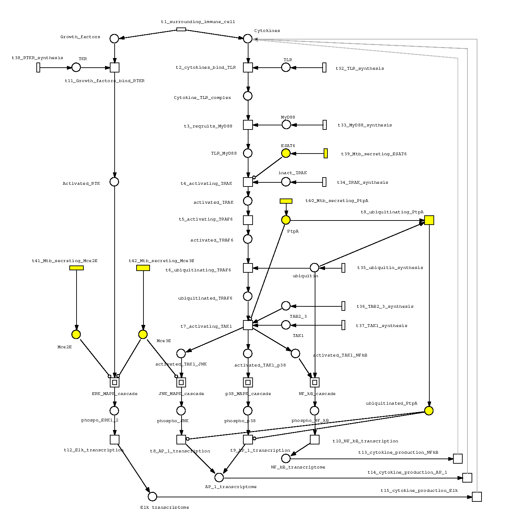
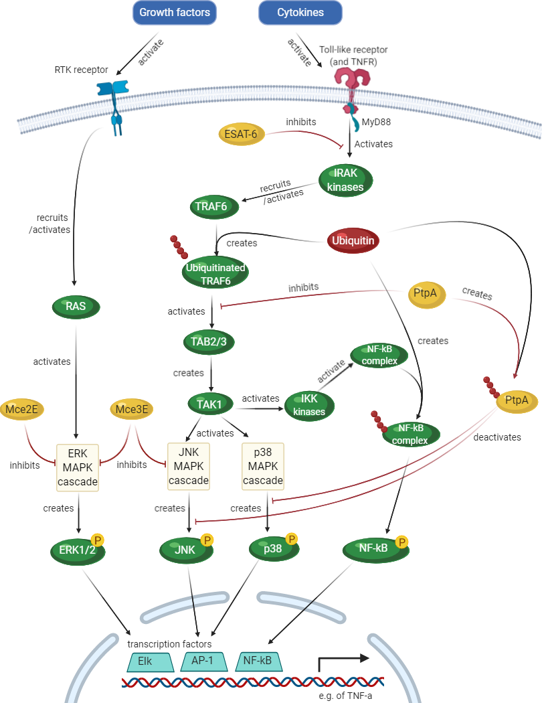

### Mycobacterium tuberculosis

This page supports our report for the Bio-modeling course. 

Our Snoopy file: <a href="../assets/docs/BMPN_Mycobacterium_signalling.xpn">BMPN_Mycobacterium_signalling.xpn</a> [255KB].

