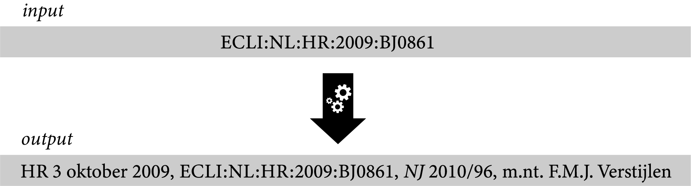

### Auto-completion of Dutch case law references

A Python script that will create a correctly formatted footnote based on the ECLI of a case (crawling the websites of the ECHR, ECJ and Rechtspraak.nl). 

It's available on <a href="https://github.com/jhvanstaalduinen/JuridischeVoetnoten">my GitHub</a>.

### Other

None yet.