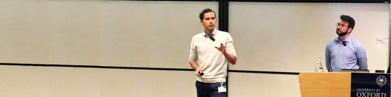

Will be filled as life progresses. You could also take a look at my [LinkedIn](https://www.linkedin.com/in/jh-van-staalduinen/) page.

## Academic

- &#10095; Journal article 'Medische aansprakelijkheid en AI' (Medical liability and AI) in *Nederlands Juristenblad* (NJB 2022/2239) [link](https://www.navigator.nl/document/id2c6abea2ecbb4bdcbc1cca6ca4960206?cpid=WKNL-LTR-Nav2&cip=hybrid), 17 October 2022
- &#10095; Presentation 'AI-verordening en aansprakelijkheid' with Gitta Veldt at '8e Jaarcongres Gezondheidsrecht', 14 October 2022
- &#10095; Peer reviewed book chapter + presentation at Netmob 2019 'An Intelligent Tree Planning Approach Using Location-Based Social Networks Data' [link](https://link.springer.com/chapter/10.1007/978-3-030-76640-5_10)

## Business

- &#10095; Internship with De Brauw in Amsterdam
- &#10095; Business course 'STBB2NY' with Stibbe in New York
- &#10095; Internship with NautaDutilh in Amsterdam and New York

## Education

- &#10095; LLM Private Law @ Leiden University (cum laude)
	 - Thesis: 'Medische aansprakelijkheid en AI', supervisor T.J. de Graaf (Instituut voor Privaatrecht)
- &#10095; MSc Computer Science - Bioinformatics @ Leiden University (cum laude)
	- Thesis: 'Classifying Breast Cancer Tissue using Imaging Mass Cytometry and Graph Neural Networks', supervisors F.J. Verbeek (LIACS) and B.P.F. Lelieveldt (Leiden University Medical Center)

